# git-flower-garden

**Your Git repositories, grown as a living garden.**

git-flower-garden turns the live commit graphs of your repositories into
flowering plants on a Blue Ridge hillside, lit by the real sun and moon over
your location. Branch heads bloom, commits leaf out, tags bear fruit, and
merges reconnect stems. Every plant is drawn from real Git history and updates
moments after you commit. Put it on a spare monitor and watch your team's work
grow. It only reads your repositories and never changes them.

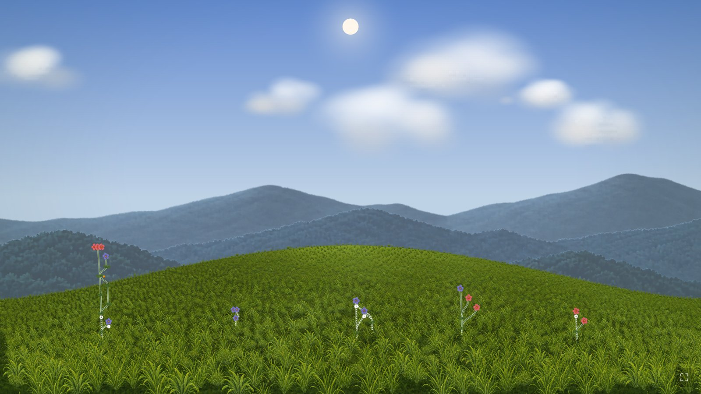

## A sky that follows the real world

The scene is built from real-world physics, not canned backdrops. The Sun,
Moon, and stars are placed for your latitude, longitude, and time; the light
on every leaf, ridge, and blade of grass follows them through the day. With
weather turned on, the local forecast brings cloud, rain, sleet, snow, fog,
and wind to the hillside.

| | |
| --- | --- |
| 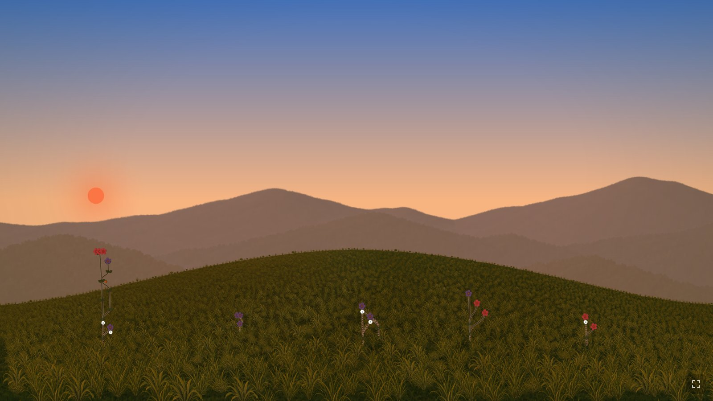 | 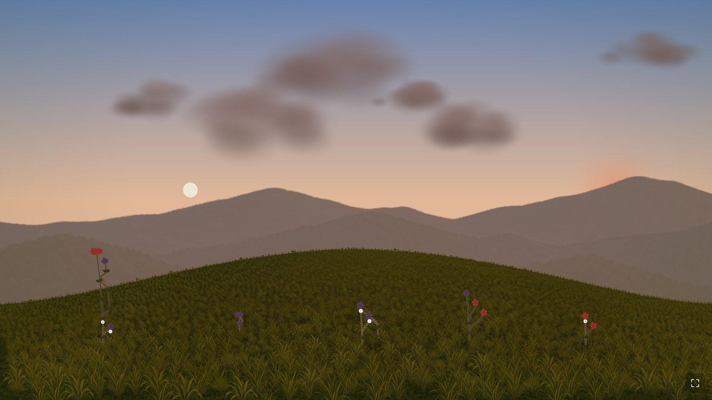 |
| **Sunrise.** The sky, the haze over the ridges, and the light on the plants change color with the Sun's height. | **Sunset**, with the Moon wherever it really is. |
| 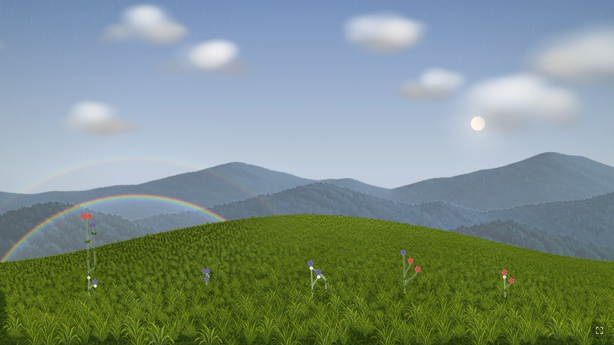 | 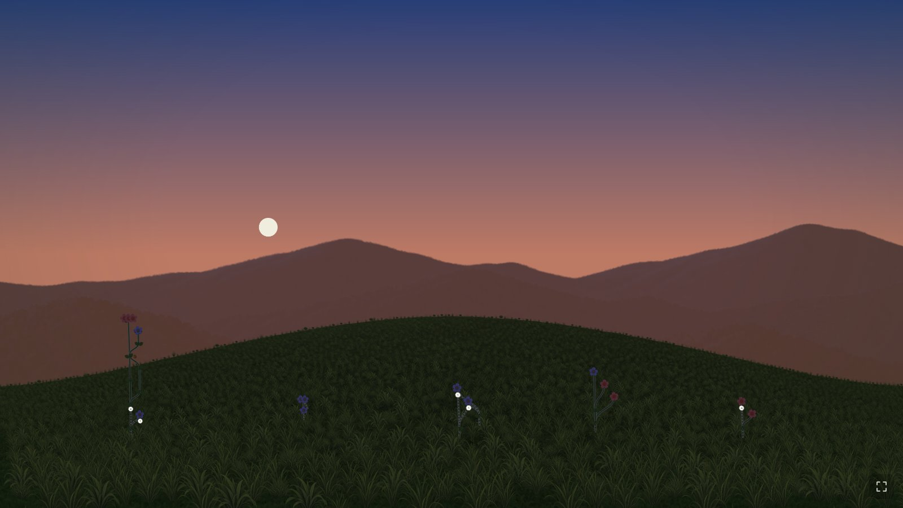 |
| **Rainbows** appear when the Sun shines on rain. Their colors and the fainter second bow come from the optics of water drops. They circle the point opposite the Sun and sink into the hill as the Sun climbs past 42°. | **Twilight** deepens through civil, nautical, and astronomical dusk. |
| 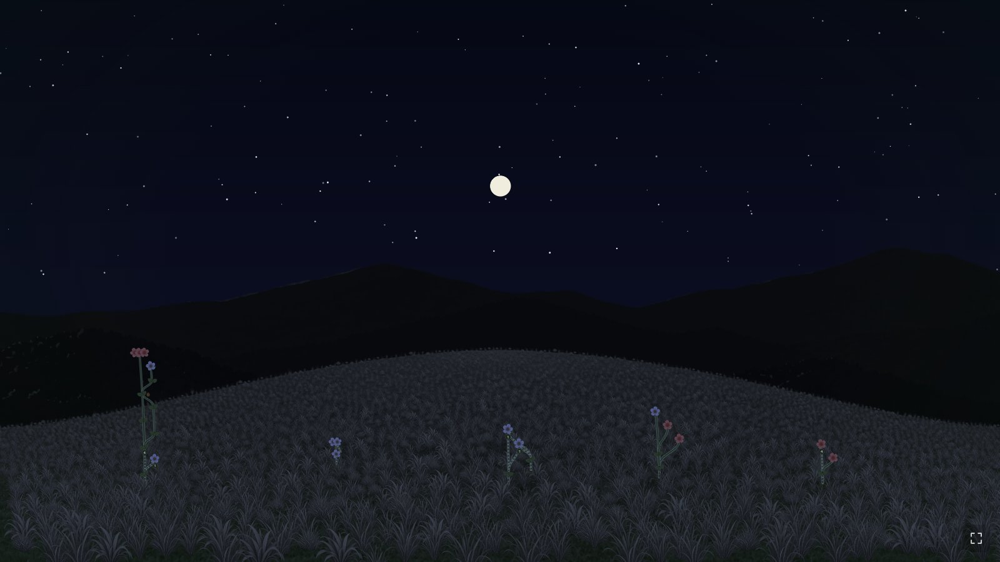 | 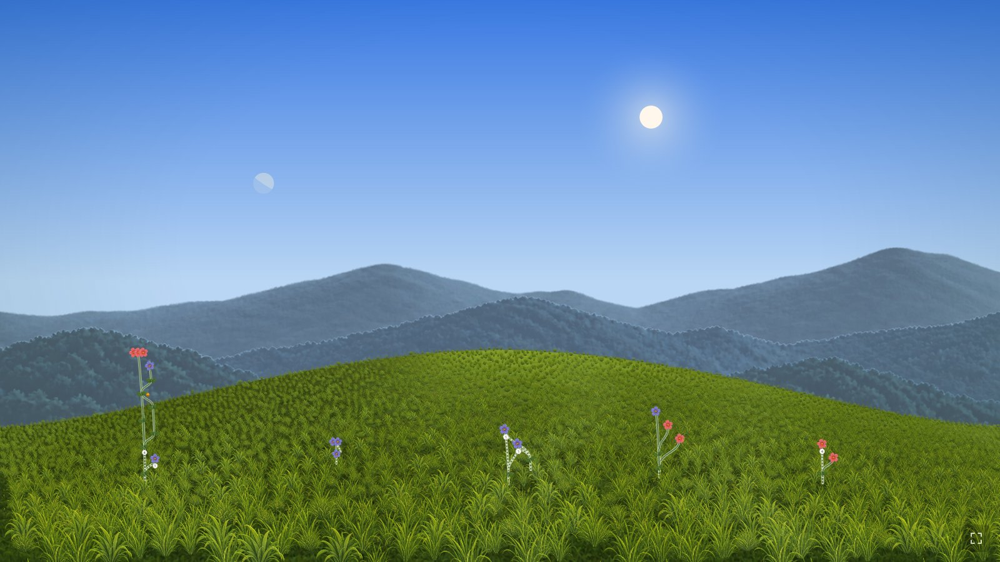 |
| **Moonlight** brightens the night by the Moon's phase, with the stars behind it. | **The Moon by day**, at its real phase and with its lit side turned toward the Sun. |
| 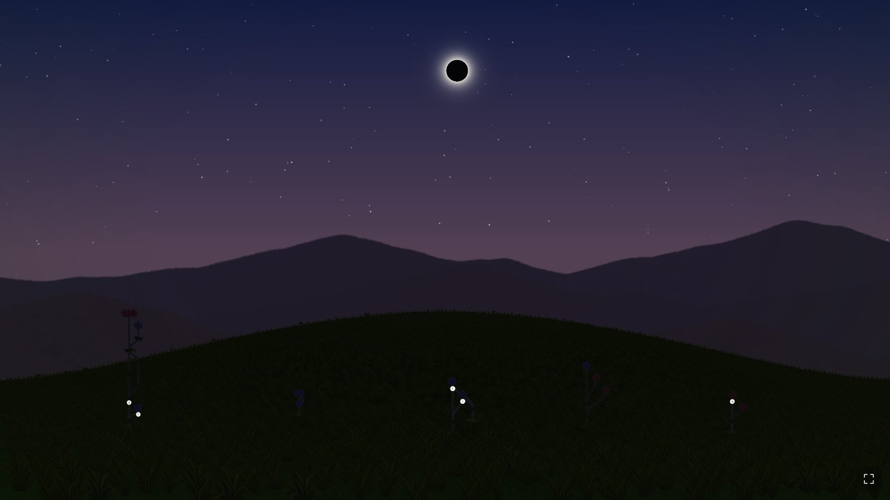 | 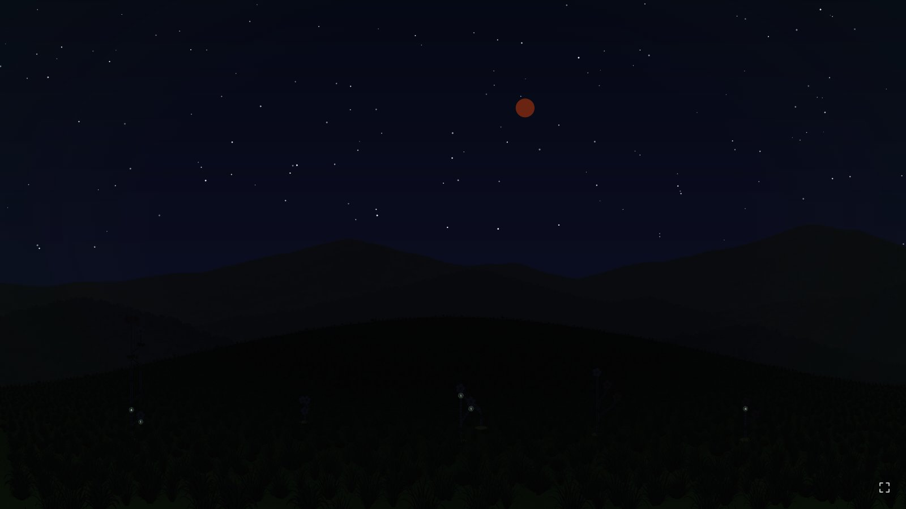 |
| **Solar eclipses**, partial, annular, and total: the day dims, and at totality the corona and brightest stars come out. | **Lunar eclipses**: the Earth's shadow crosses the Moon and turns it copper red. |
| 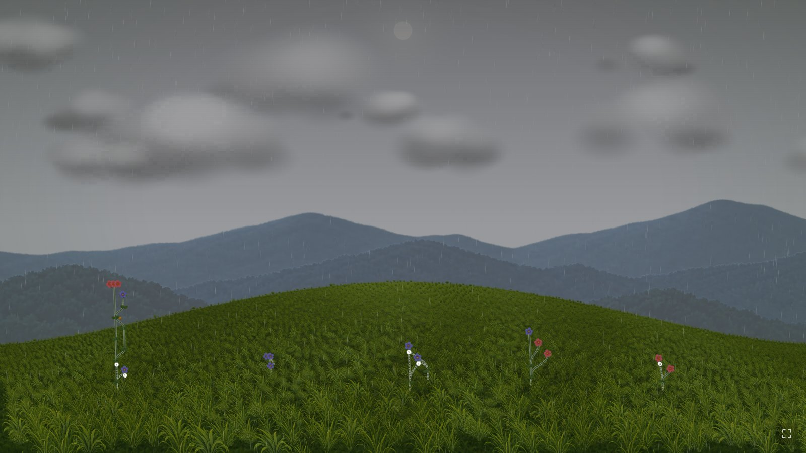 | 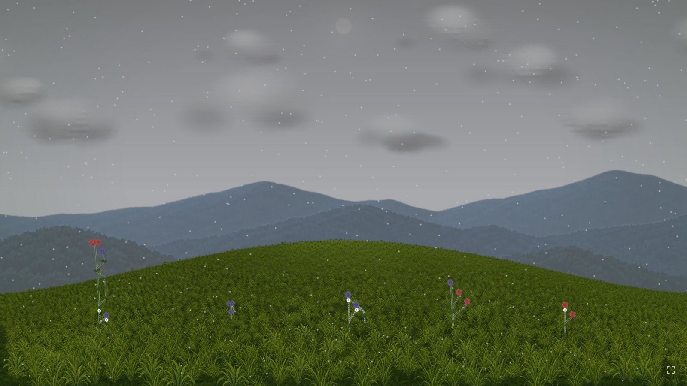 |
| **Rain and storms** grey the sky and dim the light. | **Snow and sleet** drift down through the scene. |
| 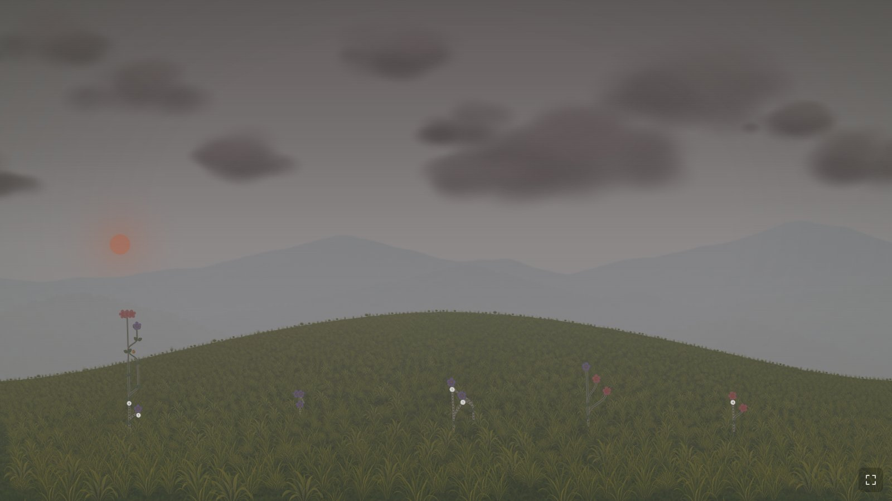 | 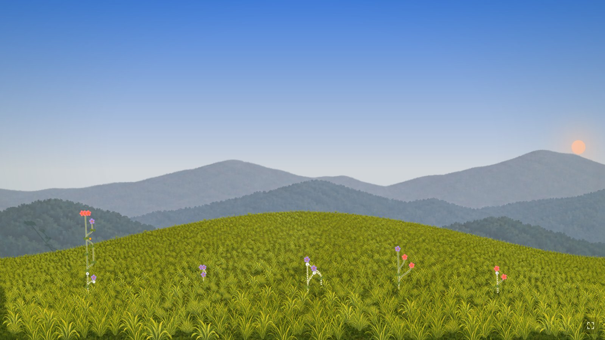 |
| **Fog** hides the far ridges first. | **Anywhere on Earth**, including the midnight Sun and polar night. |

Grass and plants move with the wind, which sends waves rolling across the
hill as gusts pass. The garden view's *Sky*, *Weather*, and *Wind* menus
preview any of these, clearly labelled as previews.

The **technical view** shows the same graph without the artwork. It shows
every branch head, the common ancestors that connect them, and recent work,
with older history folded into labeled gaps. Hover a commit for a summary and
click it for the full details.

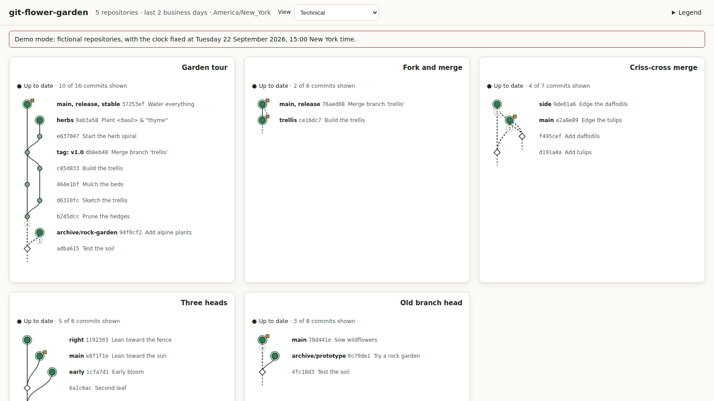

## Try it in your browser

**[Open the live demo →](https://defcello.github.io/git-flower-garden/)**

The demo needs no installation. It shows a daily snapshot of public
repositories and includes a time slider, so you can watch the light change
from sunrise to moonlight.

## Install and run locally

Requirements: [Node.js](https://nodejs.org/) 24 or newer and
[Git](https://git-scm.com/) 2.36 or newer. It runs on Windows, macOS, and Linux.

Download the `.tgz` file from the
[latest release](https://github.com/defcello/git-flower-garden/releases/latest)
and install it:

```sh
npm install --global ./defcello-git-flower-garden-<version>.tgz
git-flower-garden demo        # fictional repositories at http://127.0.0.1:4784/
```

Installing runs no install scripts and adds no other packages.

### Configure your own garden

```sh
git-flower-garden init-config        # writes a starter configuration file
# edit the file: add your repositories
git-flower-garden validate-config    # checks the file and every repository
git-flower-garden serve              # open http://127.0.0.1:4783/
```

A minimal configuration:

```json
{
  "version": 1,
  "repositories": [
    { "id": "my-app", "path": "/home/me/src/my-app", "remotes": ["origin"] },
    { "id": "upstream", "url": "https://github.com/OWNER/REPOSITORY.git" }
  ],
  "environment": { "enabled": true, "latitude": 37.23, "longitude": -80.41 }
}
```

- Each repository has an `id` and either a local `path` or a remote `url`.
- Local repositories update within moments of a commit.
- Remotes (`url` sources, or `remotes` on a local clone) are fetched on a
  schedule into git-flower-garden's own cache, using your existing Git
  credentials. Optional [GitHub push notifications](docs/user-guide.md#faster-remote-updates-with-github-push-notifications-optional)
  make updates faster.
- `environment` sets your location, so the sky follows your real sun and moon.
- Edits to the file take effect while the service runs.

The configuration file lives in your per-user settings folder
(`%APPDATA%\git-flower-garden\config.json` on Windows,
`~/Library/Application Support/git-flower-garden/config.json` on macOS,
`~/.config/git-flower-garden/config.json` on Linux). Use `--config <file>` to
choose another file. See the [user guide](docs/user-guide.md) for every option,
plus updating, troubleshooting, and uninstalling, and
[`git-flower-garden.example.json`](git-flower-garden.example.json) for a fuller
example.

## Data privacy

git-flower-garden is built to run on your machine and nowhere else.

- **No accounts, telemetry, or hosted service.** Nothing is sent anywhere
  except Git fetches to the remotes you configure.
- **Read-only.** It never checks out, pulls, pushes, commits, or installs
  hooks in your repositories. Remote fetches go into a private, app-owned
  cache, and your own clones are never touched.
- **Local only.** The viewer listens only on `127.0.0.1`, rejects requests
  from other sites, and has no endpoint that changes anything.
- **Your credentials stay with Git.** git-flower-garden uses your existing Git
  credentials and never stores them. A webhook secret is read from an
  environment variable, not from the configuration file.
- **Easy to clear.** `git-flower-garden cache --clean-all` deletes all cached
  remote data.

The public demo shows only public repositories and runs entirely in your
browser. See [SECURITY.md](SECURITY.md) to report a vulnerability.

## Build your own renderer

The garden is one way to draw the data. The service supplies Git history
and the sky; renderers decide what it looks like. Pick one from the *View*
menu, with `?renderer=<id>` in the URL, or with `display.renderer` in the
configuration. The repository includes the technical graph, the hillside
garden, and a small pixel-art garden that you can copy as a template. See
[Build your own renderer](docs/renderers.md) for browser renderers, or the
[HTTP API](docs/api.md) for renderers in another language or engine.

## Project status and contributing

Version 0.3 is a beta. The technical view is complete. In the garden view,
the lighting, sky, eclipses, weather, rainbows, wind, and the GPU renderer
are done, with Low, Balanced, and High quality settings for slower machines.
What remains before a visual release is measuring the scene on the dedicated
monitor and a 24-hour soak test. See the [roadmap](ROADMAP.md) for the plan and
[CONTRIBUTING.md](CONTRIBUTING.md) to set up a development checkout.

[MIT License](LICENSE)
