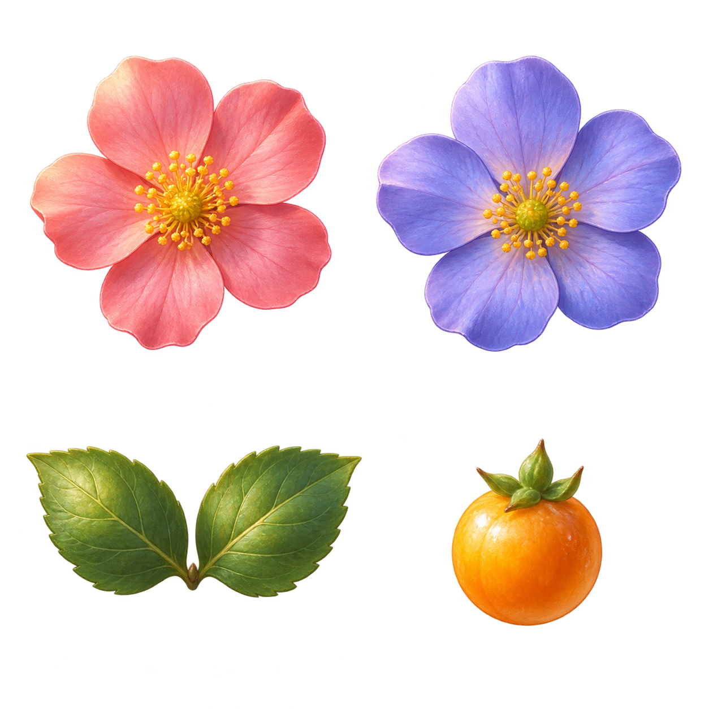

# Living garden: first art direction

P2-A review candidate, 2026-09-26. This is a working renderer proof, not the finished Phase 2 garden. Run `npm run build`, then `node dist/cli.js demo`. Choose **Garden preview · Canvas** in the View menu; **Garden preview · SVG** draws the same geometry and atlas for comparison. Technical remains the default, and the chosen view is remembered in that browser. On the hillside (up to 64 repositories, on 64 fixed positions; larger gardens use cards) the unattended scene carries no text or icons by design: hovering a plant or its icon reveals its focus icon and name, and outlines it in cyan; clicking either focuses it. Health shows without text: an empty or unreadable repository is a soil bed, an unhealthy source or unreachable remote has a marker stake with its state glyph, and a last-known plant is desaturated (roadmap section 7). The Garden tour contains a fork, merge, tag, three coincident heads, and a worktree marker, all backed by a real fictional Git repository.

## Style sheet

The direction is a small wildflower garden with soft dimensional materials, warm upper-left light, rounded Blue Ridge layers, and a manicured hill. The art is original generated imagery; stems remain procedural Git geometry. No artist, character, or proprietary scene was used as a reference.

| Element | Shape and material | Palette / scale | Git meaning |
| --- | --- | --- | --- |
| Flower family 1 | Five rounded coral petals; pollen center; translucent petal edges | Coral pink / golden yellow; 32 CSS px source cell | Branch head |
| Flower family 2 | Five lavender petals; same lighting and mass | Periwinkle / golden yellow; 32 px | Branch head, stable ref-based family |
| Leaf pair | Two pointed veined green leaves | Moss and olive; 30 px | Commit |
| Fruit | Round golden berry with green calyx | Amber; 25 px | One or more tags; inspect for all names |
| Stem | Rounded curved connection, pale crossing separation | Moss `#456b39`; bounded 2.5–6 px | Direct ancestry; dashed for collapsed history |
| Worktree marker | Small gold square, crisp dark edge | Gold; existing shared glyph | Checkout at that commit |
| Unknown history | Red broken boundary | Rust `#9a3b2a` | Missing ancestry, never a normal root |
| Grass | Fine soft blades on a smooth rolling hill | Golden olive highlights / deep green shadows | Decorative setting only |
| Ridges | Layered rounded silhouettes with atmospheric haze | Desaturated indigo to pale blue | Decorative setting only |
| Sky | Broad blue-to-cream gradient, soft cloud volumes | Day blue / warm horizon | Static lighting study only |

## Lighting and scale studies

The preview offers day, dawn, dusk, and night color grades. Dawn warms the left; dusk warms the right; night lowers landscape luminance. The screenshots exercise 1920×1080 and 3840×2160 viewports. They are composition studies: there is no computed sun, moon, star field, or live weather yet. Night panel illumination and separate foreground/background light response need further art work.

The tool returned a 1254×1254 RGBA atlas and a 1672×941 RGB backdrop, despite larger dimensions requested in the prompts. The 4K example upscales the backdrop; it is not native 4K artwork. Keep the initial library small until the direction is reviewed. Transparent sprite cells are sampled directly in both compositors without editing their source pixels.

## Fidelity and interaction

- Technical, Canvas, and botanical SVG share the same reduced DAG, coordinates, curve paths, labels, selection, focus camera, details, and keyboard commit list. The Canvas proof retains the SVG interaction overlay; replacing that layer is a later measured decision.
- A ref's flower family is seeded from repository ID and ref label, not its current OID. Three flowers can represent a cluster; every ref remains available in labels and details. Tag fruit denotes tag presence; individual tag names remain inspectable.
- No decorative stem joins disconnected components. All visible stem paths come from real graph edges or explicitly marked history tails. Width is decorative; full split/merge taper rules remain P2-B work.
- Drawing is event-driven, with no continuous animation loop. Canvas skips drawing while the document is hidden and repaints on visibility/resize. The backing buffer caps DPR at 2 and maximum dimension at 8192 pixels and total area at four million pixels; very large overviews may soften, while the vector interaction layer remains exact.
- Atlas failure falls back to the technical graph. Technical mode is always available from View.

## Provenance and review

See [the exact prompts](prompts.md) and [asset manifest](../../src/ui/public/asset-manifest.json). Built-in image generation produced both images; no API key or external stock assets were used. Manifest fields record dimensions, anchors, scaling, source, generation/editing provenance, intended MIT distribution, attribution, and redistribution review status. No exclusive copyright claim is made for generated output.

Before expanding the library, the maintainer should review the flower materials and size, hill/ridge composition, and day/night readability on the intended monitor. This is the P2-A roadmap exit gate: “maintainer visual review accepts the direction.” The runnable preview makes that decision reviewable. P2-B–E remain open: final botanical layout/motion, integrated plot composition, offline astronomy and optional weather, quality presets, and the 24-hour soak.

## Verification

`tests/e2e/botanical.spec.ts` compares OIDs, labels, and edge paths across all three renderers; preserves selected details and zoom through switches; verifies coincident ref/worktree inspection and image-load fallback; captures all four lighting studies at 1080p and 4K; and checks a narrow viewport. It also records a 2,000-node Canvas/SVG comparison using identical geometry and the same atlas. Timing evidence and limitations are recorded in ADR 0015.

Regenerate the review images with `GARDEN_E2E_CHANNEL=chromium npx playwright test tests/e2e/botanical.spec.ts` (use an installed browser channel for your machine). Images are in Playwright's `test-results` directory. The screenshot matrix is review evidence, not a pixel-golden test or proof of aesthetic acceptance.
