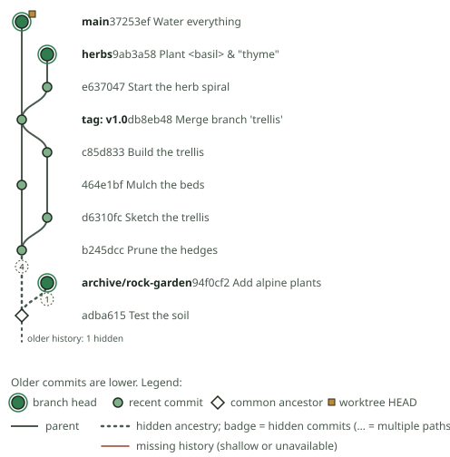

# 0009: Visible graph, reduced edges, layout, and the static SVG probe

- Status: Accepted (closes P0-B; starts P1-B)
- Date: 2026-09-26
- Roadmap: sections 4.2, 4.4, 7 (graph layout), 8 (P0-B), 9 (P1-B)

## Static SVG probe

`npm run render:fixture -- <fixture> <now> <out.svg>` builds a demo fixture as a
real Git repository and runs the whole read-only pipeline:

```text
readSnapshot (Git readers) -> historyWindow -> buildVisibleGraph -> layoutGraph -> renderSvg
```



`gardenTour` viewed on Tuesday afternoon shows 10 of 16 reachable commits. The
window is Monday and Tuesday. Monday's fork (`trellis`) merges back as a real
two-parent merge tagged `v1.0`, and `herbs` is still open. Two years of quiet
history between `Prune the hedges` and `Test the soil` collapse into one dashed
edge with a "4" badge. The 2024 `archive/rock-garden` head survives, joined to
its base `Test the soil` through one hidden commit. One hidden root commit sits
below that base, drawn as an "older history" tail. The old `v0.9` tag's commit
stays hidden. [criss-cross.svg](assets/criss-cross.svg) shows both merge bases
of a criss-cross merge kept.

## Decisions

### Mandatory set and edge semantics (`src/core/visible-graph.ts`)

- Visible = branch heads ∪ best-common-ancestor anchors ([ADR 0007](0007-ancestor-selector-evidence.md))
  ∪ commits in the window ∪ worktree HEADs ∪ commits revealed for inspection.
  Each node lists every reason it is included.
- A **direct** edge is an actual parent relationship, with its parent-order
  indexes. A **collapsed** edge passes through hidden commits. It carries the
  exact hidden count when exactly one such path exists, otherwise null
  ("multiple paths"). A child can have both a direct and a collapsed edge to the
  same parent (for example, a merge whose other side is hidden). Both are kept,
  because each is a distinct fact.
- A **tail** marks hidden ancestry that reaches no visible commit. It ends at a
  real root, or at a boundary where history is missing (a shallow clone or an
  unavailable object). Boundaries use a different symbol, so missing history is
  never drawn as a normal root.
- Hidden regions are summarized once with memoized path counts (capped at "more
  than one"), so shared old history is walked once rather than per child.
- Future-dated commits are flagged. Committer time is recorded on nodes for
  display and tie-breaking only.

### Layout (`src/render/layout.ts`)

- **One commit per row, in topological order** (children before parents).
  Among commits that are ready at the same time, newer committer time goes
  higher, then lane priority, then OID. Timestamps only break ties, so clock
  skew cannot invert an edge. A first attempt used rows by topological height,
  which put unrelated commits on the same row and overlapped their labels. It
  was rejected after visual review.
- **Lanes:** each commit hands its lane to its first visible parent, and a lane
  span is never shared. When a non-first-parent edge has both ends in one lane
  with other commits between them, it gets a **detour** (drawn as a sideways
  bulge), so no straight edge passes through a commit.
- Output is canonical: sorted nodes, edges, and tails, with ties broken by OID.
  Shuffled input gives an identical layout.

### Rendering (`src/render/svg.ts`)

Node kinds differ in shape (a ringed disc for heads, a disc for recent commits,
a hollow diamond for ancestors, a square marker for worktrees), and edge kinds
differ in dash pattern. Hidden counts appear as badges, with full text on hover.
Every piece of repository text is XML-escaped. The SVG has a `<title>` and a
`<desc>` stating the visible and reachable counts.

## Verification

| Property | Check |
| --- | --- |
| Business-day window | Roadmap examples; DST weekends; Santiago's missing midnight; +5:45 and +14 zones. A minute-by-minute oracle agrees across 8 zones × 6 DST-adjacent instants with random N and weekday sets. The oracle catches a deliberate "midnight from noon's offset" bug (3 tests fail). |
| Mandatory set | Recomputed independently (heads, oracle anchors, window, worktrees) on 1,500 random DAGs with missing objects and shallow boundaries. |
| Reduced edges and tails | An exponential path-enumeration oracle agrees on edges, kinds, exact hidden counts, multi-path nulls, and root versus boundary tails. Guards ensure more than 500 collapsed edges, more than 50 multi-path edges, and more than 100 boundary tails occur. Two deliberate bugs (path counting, root/boundary confusion) are caught. |
| Layout | On 400 random graphs with skewed clocks: unique positions, parents strictly lower, no straight edge through a commit, and identical output for shuffled input. |
| End to end | `tests/git/snapshot.test.ts` runs `gardenTour` through real Git and checks the visible set, collapsed counts, tail, tag decoration, and hidden old tag. |
| Rendering | Hostile ref names and messages (`</text><script>…`) are escaped. Every visible commit and edge is present. |

## Found and fixed along the way

`for-each-ref` fails for the **whole repository** if one ref points at a
missing object and the format asks for object types. `readRefs` now lists names
and OIDs, then batch-checks types with `cat-file`. A broken ref becomes
`objectType: "missing"` and is reported in the snapshot's `missingTips`, and
every other ref still renders.

## Deferred

- Small context nodes for readability (roadmap section 4.4) are optional and
  not implemented yet.
- Persistent lane preferences across updates, for minimal movement, belong to
  P1-C with live updates.
- Old-tag search and index: `reveal` provides the temporary expansion
  mechanism. Lookup UI arrives in P1-C.
